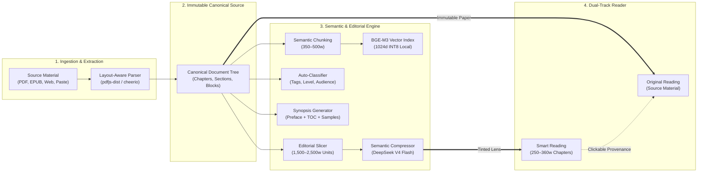

# Smart Reader

### Local-First Neural Reading Library — Loss-Bounded Semantic Compression for Long-Form Documents

> Ingests PDFs, EPUBs, web articles, and raw text, then produces a navigable **Smart Reading** layer where every compressed sentence traces deterministically to its source passage.

<p align="left">
  <a href="https://nodejs.org/"></a>
  <a href="https://react.dev/"></a>
  <a href="https://vitejs.dev/"></a>
  <a href="https://www.typescriptlang.org/"></a>
  <a href="https://tailwindcss.com/"></a>
  <a href="https://expressjs.com/"></a>
  <a href="https://github.com/WiseLibs/better-sqlite3"></a>
  <a href="https://huggingface.co/BAAI/bge-m3"></a>
</p>

<p align="left">
  <a href="#test"></a>
  <a href="#design-philosophy"></a>
  <a href="#roadmap"></a>
  <a href="./LICENSE"></a>
</p>

---

## Overview

Smart Reader is a **reading and comprehension platform**, not a lossy summarization utility. It maintains two representations of every document:

| Representation | Behavior |
|---|---|
| **Original Reading** | **Immutable source.** The text exactly as uploaded. Nothing in the system modifies it. |
| **Smart Reading** | **Derived lens.** A compressed representation — 250–360 words per ~1,500–2,500-word source unit — with every sentence traceable to the specific source chunks it draws from. |

This is the **two-representation invariant**:

```text
ORIGINAL READING  →  immutable source, never touched
SMART READING     →  derived lens, fully traceable back to source
```

Every feature — the reader, the provenance chain, the fallback markers, the synopsis panel — exists to keep the relationship between source and lens visible, honest, and verifiable.

---

## Why compression, not summarization

A summarizer asks *"what is the gist?"* and produces output proportional to input. A compressor asks *"what would this say if every sentence carried 5–8× its information?"* and preserves every distinct concept, argument, and factual claim.

Smart Reader implements **loss-bounded semantic compression**. The compression ratio is the fundamental quality metric:

| Metric | Target |
|---|---|
| Source processing unit | 1,500–2,500 words |
| Smart Chapter output | 250–360 words (hard bounds 180–450) |
| Target compression ratio | ~7:1 |
| Observed ratio band (canonical fixture) | 4.82 – 7.28 |

> Full distinction: [`docs/PRODUCT_VISION.md`](./docs/PRODUCT_VISION.md) §"Compression, not summarization".

---

## Tech Stack

| Layer | Technology |
|---|---|
| **Runtime** | Node.js 22 (LTS, pinned via `.nvmrc`) |
| **Backend** | Express 4.19, `better-sqlite3` (WAL mode), cascading foreign keys |
| **Frontend** | React 18.3, Vite 5.4, TypeScript 5.3, Tailwind CSS 3.4, React Query, Zustand |
| **Embeddings** | BGE-M3 1024d, INT8 quantized, local (`@huggingface/transformers`) — multilingual, 170+ languages |
| **PDF parsing** | `pdfjs-dist` with layout heuristics |
| **Web extraction** | `cheerio` with chrome stripping |
| **AI (compression)** | OpenRouter → DeepSeek V4 Flash (configurable; Ollama supported for fully local mode) |
| **Testing** | 17 regression suites, real fixtures, ~5–7 min runtime |

---

## Features

### Backend
- **Ingestion** — PDF, EPUB, HTML, Markdown, plain text, web URLs, raw paste
- **Structural analysis** — chapter detection, front/back matter classification, multi-signal heading recognition, TOC-anchored page recovery, header/footer suppression
- **Semantic indexing** — 350–500 word chunks with hybrid cross-source retrieval (vector similarity + keyword scoring + diversity re-rank)
- **Auto-classification** — LLM-based `contentType`, tags, reading level, target audience; heuristic fallback if the provider is unavailable
- **Editorial planning** — 1,500–2,500 word source-unit slicing with even distribution and defensive subdivision for oversize sections
- **Compression** — grounded Smart Chapter synthesis with reasoning disabled and hard word bounds
- **Synopsis** — generated from preface + TOC + strategic samples, sequenced before chapter compression
- **Job lifecycle** — 5 tracked stages (`INGEST` → `SEMANTIC_INDEX` → `CLASSIFICATION` → `SYNOPSIS` → `SYNTHESIS`) with boot-time zombie sweep and `INTERRUPTED` rendering
- **Fallback honesty** — every deterministic-fallback representation carries `fell_back: true`, `fallback_reason`, and word-count-violation metadata

### Frontend
- **Library** — responsive book grid with search, content-type filters, dynamic tag filter chips, Smart badge
- **Book Details** — hero, classification chips, synopsis panel, chapter list, semantic intelligence panel, AI-provider disclosure
- **Reader** — Smart-first default when a representation exists, with a subtle Source affordance for the original
- **Canonical block renderer** — recursive rendering of headings, paragraphs, quotes, lists, code, tables, callouts, separators
- **Import** — File / Web / Paste tabs with real XHR progress and a job-driven pipeline stepper
- **Cinematic import** — pipeline stages drive page-turn, chunk-gather, tag-fade, chapter-card animations; dynamic polling; reduced-motion collapse; mobile-safe at 375 px
- **Design system** — four themes (default / warm / dark / glass), full Tailwind token set, WCAG AA baseline

### Infrastructure
- **Test isolation** — test runs execute against a separate DB (`storage/test-data.db`) and do not touch the development library
- **Fixture licensing** — tracked in [`docs/RIGHTS.md`](./docs/RIGHTS.md)
- **Local-first** — no cloud calls except configured AI providers; BGE-M3 runs entirely on-device

---

## Architecture



### End-to-End Pipeline

```text
User Material → Extraction → Parsing → Canonical Source → Structural Analysis 
              → Semantic Chunking → Semantic Index → Auto-Classification 
              → Editorial Organizer → Source-Unit Slicing → Editorial Chapter Plan 
              → Compression → Grounded Reader-Facing Content
```

### Key Documentation

| Document | Purpose |
|---|---|
| [`docs/PRODUCT_VISION.md`](./docs/PRODUCT_VISION.md) | North star, two-representation invariant, three laws |
| [`docs/ARCHITECTURE_AUDIT.md`](./docs/ARCHITECTURE_AUDIT.md) | 25 Q&A backend walkthrough |
| [`docs/FRONTEND_ARCHITECTURE.md`](./docs/FRONTEND_ARCHITECTURE.md) | Component tree, state map |
| [`docs/FRONTEND_BLUEPRINT.md`](./docs/FRONTEND_BLUEPRINT.md) | Design narrative |
| [`docs/FRONTEND_BLUEPRINT_SPEC.md`](./docs/FRONTEND_BLUEPRINT_SPEC.md) | Engineering contract |
| [`docs/CANONICAL_TEST_BOOK.md`](./docs/CANONICAL_TEST_BOOK.md) | Canonical verification fixture |
| [`docs/RIGHTS.md`](./docs/RIGHTS.md) | Fixture licenses, user content policy |
| [`docs/SESSION_HANDOFF.md`](./docs/SESSION_HANDOFF.md) | Current project state & handoff guide |

---

## Getting Started

### Prerequisites
- **Node.js 22 LTS** (see `.nvmrc`)
- **~1.2 GB free disk space** — INT8 BGE-M3 model downloads on first run
- *Optional:* OpenRouter API key for real AI compression
- *Optional:* Ollama running locally for fully offline inference

### Install

```bash
git clone https://github.com/avengersvstheflash/Smart-Reader.git
cd Smart-Reader
nvm use
npm install
cp .env.example .env # edit .env with your API keys
```

### Run

```bash
# Backend (port 3000)
node backend/server.js

# Frontend (port 5173, second terminal)
cd frontend
npm run dev
```

Open `http://localhost:5173/` and import a document.

### Test

```bash
npm test # 17 regression suites, ~5–7 minutes
```

> **Test Isolation:** Test runs execute against `storage/test-data.db` — your working development library at `storage/data.db` is never touched.

---

## Roadmap

Active development phases (full roadmap in [`docs/ROADMAP_2026-09.md`](./docs/ROADMAP_2026-09.md)):

### Phase 4 — Complete (2026-09-23)
Compression enforced. Import pipeline hardened. Classification shipped. Cinematic import live. Test infrastructure isolated. All 17 suites green.

**Selected shipped work:** Web + Paste import tabs (4.6) · Cinematic import (4.7) · Compressor prompt + source-unit sizing (4.8.1) · Even-distribution slicing (4.8.3) · Synopsis fallback honesty (4.9) · Auto-classification (4.10) · Zombie job resilience (4.11) · Synopsis prompt rewrite (4.13) · Compression eval harness (4.14) · Parser stress + front-matter verification (4.15) · Pre-hydration contract test (4.19) · Fixture licensing (4.20) · Import trust path (4.21) · Editorial planner guard (4.24) · Test DB isolation (4.25).

### Phase 5 — In Progress

| Phase | Status | Description |
|:---:|:---:|---|
| **5.1** | 🚧 | Paragraph-level provenance resolution (backend contract) |
| **5.2** | ⏳ | Reader click-through UI — the moat made interactive |
| **5.3** | ⏳ | Research mode collection view |
| **5.5** | ⏳ | Library polish + UI/UX backlog |
| **5.6** | ⏳ | Validation and refine loops (pre-LLM source guard, post-LLM output guard) |
| **5.7** | ⏳ | Python sidecar architecture (OCR, Discussion, Story) |

### Later

| Phase | Description |
|---|---|
| **Phase 6** | Tauri packaging (native desktop app) |
| **Build 5** | Audio mode (local Kokoro-82M TTS) |
| **Build 6** | Discussion mode (local Ollama multi-agent) |
| **Build 7** | Story mode (narrative + image pipeline) — frozen until winter–spring 2027 |

> Full roadmap: [`docs/ROADMAP_2026-09.md`](./docs/ROADMAP_2026-09.md).

---

## Design Philosophy

**Three laws. Every feature serves them:**

1. **Source is paper.** Original reading renders on calm neutral paper with zero accent chrome. It looks like a book because it *is* the book.
2. **The lens is tinted.** Smart reading carries a quiet accent identity. You know which representation you're in without reading a word.
3. **Derivation never masquerades as source.** Smart text is never rendered without a provenance affordance. Copy never calls derived text "the book."

---

## Known Limitations

Developed in strict phases. Each phase closes clean — tests green, tree clean, verification at HEAD — before the next opens. Tracked limitations are honest, not hidden:

| Limitation | Status |
|---|---|
| **OCR for image-only PDFs** | Deferred to Python sidecar (Phase 5.7). Empty-content PDFs fail honestly today. |
| **Synthesis fallback verification** | Cannot be verified without Phase 5.6 validation loop. |
| **Tag chip placement** | Hero shows tags inline; relocation queued for Phase 5.5. |
| **Research mode collection view** | Import half shipped in 4.6; collection view queued for Phase 5.3. |
| **Preface-less source handling** | Synopsis retries and produces acceptable prose, but path is fragile. |
| **Fixture licensing** | Two fixtures require swap before commercial release. See [`docs/RIGHTS.md`](./docs/RIGHTS.md). |

---

## Contributing

Solo development, active. Issues and discussion via the GitHub issue tracker.

**Commit conventions:**
- `feat(scope): <description>` — new capability
- `fix(scope): <description>` — bug fix
- `docs: <description>` — documentation only
- `chore: <description>` — build, deps, tooling
- `phase<N>.<M>: <description>` — roadmap phase work

*Test suite must stay green (`npm test` → 17/17 passing) through every commit.*

---

## Acknowledgements

Built with:
- [`pdfjs-dist`](https://github.com/mozilla/pdf.js) — PDF parsing
- [`@huggingface/transformers`](https://github.com/huggingface/transformers.js) — local inference
- [`better-sqlite3`](https://github.com/WiseLibs/better-sqlite3) — SQLite
- [`React`](https://react.dev/) + [`Vite`](https://vitejs.dev/) + [`Tailwind CSS`](https://tailwindcss.com/)
- [`OpenRouter`](https://openrouter.ai/) — cloud LLM gateway
- [`DeepSeek`](https://deepseek.com/) — V4 Flash for chapter compression

Testing was performed against purchased technical reference materials. No third-party content is redistributed with this repository.
