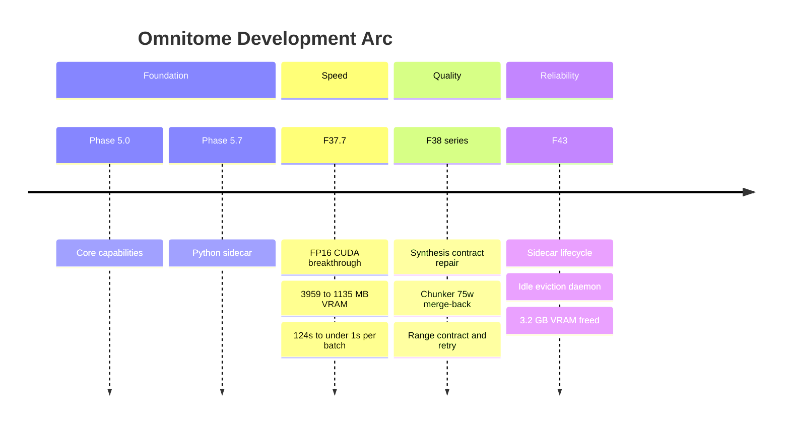
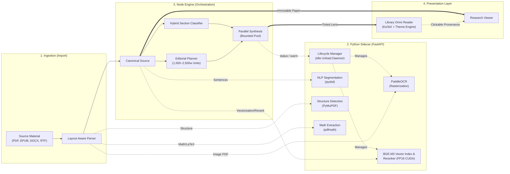

# Omnitome

> A local-first neural reading library whose differentiator is **loss-bounded, provenance-aware semantic compression**.

*Ingests PDFs, EPUBs, DOCX, RTF, web articles, and raw text. Enforces a clean architectural split: **Import** is the entry point, **Library** holds curated Omni Readings only, and **Research** holds immutable original sources where every compressed sentence traces deterministically to its source passage.*

[](https://nodejs.org/) [](https://www.python.org/) [](https://react.dev/) [](https://github.com/WiseLibs/better-sqlite3) [](https://github.com/avengersvstheflash/Smart-Reader) [](https://github.com/avengersvstheflash/Smart-Reader) [](https://github.com/avengersvstheflash/Smart-Reader) [](https://github.com/avengersvstheflash/Smart-Reader) [](https://github.com/avengersvstheflash/Smart-Reader) [](https://github.com/avengersvstheflash/Smart-Reader/releases/tag/v0.6.0) [](./LICENSE)

---

## The Two-Representation Invariant

| Representation | Behavior |
| --- | --- |
| 📄 **Original Reading** | **Immutable source.** The text exactly as uploaded. Nothing in the system modifies it. Lives in Research. |
| 🧠 **Omni Reading** | **Derived lens.** An adaptively compressed representation preserving concepts and arguments with deterministic provenance. Lives in Library. |

```text
ORIGINAL READING  →  immutable source, never touched
OMNI READING      →  derived lens, fully traceable back to source
```

---

## 📈 Recent Milestones


```mermaid
timeline
    title Omnitome Development Arc
    section Foundation
        Phase 5.0 : Core capabilities
        Phase 5.7 : Python sidecar
    section Speed
        F37.7 : FP16 CUDA breakthrough
              : 3959 to 1135 MB VRAM
              : 124s to under 1s per batch
    section Quality
        F38 series : Synthesis contract repair
                   : Chunker 75w merge-back
                   : Range contract and retry
    section Reliability
        F43 : Sidecar lifecycle
            : Idle eviction daemon
            : 3.2 GB VRAM freed
```

---

## ⚡ Performance

Omnitome processes a 508K-word technical book end-to-end on a laptop RTX 3050 in under 6 minutes, with models that idle-unload to 103 MiB VRAM when not in use.

| Metric | Before F37 | After F37.7 + F43 | Impact |
| :--- | :--- | :--- | :---: |
| **508K-Word Import** | Multi-hour projection | **~5.9 minutes** | 🚀 30x+ faster |
| **Semantic Index Throughput** | ~50–150 ms/chunk (CPU) | **~78 ms/chunk** (GPU FP16) | ⚡ Real-time indexing |
| **BGE-M3 Active VRAM** | 3,959 MiB | **1,135 MB** | 📉 71% reduction |
| **Idle VRAM (All Evicted)** | n/a (held permanently) | **103 MiB** | 🧹 3.2 GB freed |
| **16-Chunk Embedding Batch** | ~124 seconds | **< 1 second** | ⚡ 120x+ speedup |
| **Auto-Reload Latency** | n/a | **~6.5 seconds** | 🔄 Transparent reload |

---

## 📖 What Works Today

| Format | Status | Example Tested |
| :--- | :---: | :--- |
| **PDF (text)** | ✅ | Reddi ML Systems (508K words) |
| **PDF (scanned)** | ✅ | Kaggle dojo, Boston Art Annual |
| **EPUB** | ✅ | Moby Dick, Les Misérables |
| **DOCX** | ✅ | Generated sample |
| **RTF** | ✅ | Generated sample |
| **Markdown** | ✅ | Standard CommonMark |
| **Text / Paste** | ✅ | UTF-8 clipboard buffer |
| **Web URL** | ✅ | Wikipedia, OpenLibrary |
| **Japanese (UTF-8)** | ✅ | センツアマニ (Mori Ōgai) |
| **French (UTF-8)** | ✅ | Monsieur Vénus |
| **Legacy ShiftJIS** | ⚠️ | Requires pre-conversion to UTF-8 |

> *Legacy ShiftJIS/Aozora files require conversion to UTF-8 before import. Auto-detection is planned for v1.x. Max file size configurable via `IMPORT_MAX_SIZE_MB` (50–200 MB).*

---

## 🏗️ Architecture & Data Flow

Omnitome leverages a **Hybrid Node + Python** architecture. Node.js owns orchestration, state (SQLite), and API routing. A local FastAPI Python Sidecar (`127.0.0.1:8765`) owns neural and CPU-heavy primitives. Node is the sole SQLite writer.


```mermaid
flowchart LR
    subgraph INGESTION ["1. Ingestion (Import)"]
        RawDoc["Source Material<br/>(PDF, EPUB, DOCX, RTF)"] --> Parser["Layout-Aware Parser"]
    end
    subgraph PYTHON_SIDECAR ["2. Python Sidecar (FastAPI)"]
        Lifecycle["Lifecycle Manager<br/>(Idle Unload Daemon)"]
        OCR["PaddleOCR<br/>(Rasterization)"]
        NLP["NLP Segmentation<br/>(pysbd)"]
        Structure["Structure Detection<br/>(PyMuPDF)"]
        Math["Math Extraction<br/>(pdfmath)"]
        Embedder["BGE-M3 Vector Index &<br/>Reranker (FP16 CUDA)"]
        Lifecycle -.->|"Manages"| OCR & Embedder
    end
    subgraph NODE_ENGINE ["3. Node Engine (Orchestration)"]
        direction TB
        Canon["Canonical Source"]
        Classifier["Hybrid Section Classifier"]
        Planner["Editorial Planner<br/>(1,500–2,500w Units)"]
        Compressor["Parallel Synthesis<br/>(Bounded Pool)"]
        Canon --> Classifier & Planner --> Compressor
    end
    Parser --> Canon
    Parser -.->|"Image PDF"| OCR
    Parser -.->|"Structure"| Structure
    Parser -.->|"Math/LaTeX"| Math
    Canon -.->|"Sentences"| NLP
    Canon -.->|"Vectorization/Rerank"| Embedder
    Compressor -.->|"status / warm"| Lifecycle
    subgraph PRESENTATION ["4. Presentation Layer"]
        Canon ===>|"Immutable Paper"| ResearchViewer["Research Viewer"]
        Compressor ===>|"Tinted Lens"| LibraryReader["Library Omni Reader<br/>(KaTeX + Theme Engine)"]
        LibraryReader -.->|"Clickable Provenance"| ResearchViewer
    end
```

> *Models (PaddleOCR, BGE-M3 embedder, BGE reranker) are managed by the Lifecycle Manager, which idle-unloads them after their per-model TTL and auto-reloads on demand in ~6.5s.*

**Provider Abstraction:** OpenRouter (cloud fallback) or Local (OpenAI-compatible: Ollama at `http://localhost:11434/v1`, LM Studio, llama.cpp, vLLM). Trust boundaries ensure the Python sidecar NEVER calls an LLM.

---

## 🎨 Theme & Visual System

Omnitome features 5 adaptive themes (`spring`, `sakura`, `coffee`, `cyberpunk`, `omni`) with procedural cover art, custom animated sigils, and KaTeX math rendering governed by three design laws:
1. **Source is paper:** Original reading renders on neutral, unadorned paper.
2. **The lens is tinted:** Omni reading carries a quiet accent identity reflecting synthesis.
3. **Derivation never masquerades as source:** Every Omni claim retains an explicit, clickable provenance path.

---

## 🛠️ Getting Started

### Prerequisites & Installation
- **Node.js 22 LTS** (see `.nvmrc`) and **Python 3.10+** (local sidecar)
- **Local LLM Engine** (Ollama recommended) or OpenRouter API key

```bash
git clone https://github.com/avengersvstheflash/Smart-Reader.git && cd Smart-Reader
nvm use && npm install && cp .env.example .env
cd sidecars/python && python -m venv .venv && source .venv/bin/activate && pip install -r requirements.txt && cd ../..
```

### Running the App & Testing
```bash
# Terminal 1 (Sidecar :8765): cd sidecars/python && uvicorn main:app --port 8765
# Terminal 2 (Node :3000):    node backend/server.js
# Terminal 3 (Vite :5173):    cd frontend && npm run dev

node scripts/run-all-tests.js  # 41/41 test suites passing
```

---

## 🗺️ Roadmap & Phase Status

| Phase | Description | Status |
| :---: | --- | :---: |
| **5.0** | Core Capabilities | 🟢 CLOSED |
| **5.7** | Python Sidecar Foundation | 🟢 CLOSED |
| **5.8.0** | Compression Contract Repair | 🟢 CLOSED |
| **5.8a/c** | Rebrand + Omni Theme System | 🟢 CLOSED |
| **F37.x** | FP16 Embedding Breakthrough | 🟢 CLOSED |
| **F38.x** | Synthesis Contract + Chunker + Titles | 🟢 CLOSED |
| **F42** | Diverse Fixture Corpus | 🟢 SCAFFOLDED |
| **F43** | Sidecar Lifecycle + Idle Unload | 🟢 CLOSED |
| **F45** | Configurable Import Cap | 🟢 CLOSED |
| **5.8i** | Frontend Walkthrough | ⏳ QUEUED |
| **5.8j-k** | Settings + Help pages | ⏳ QUEUED |
| **5.9** | Kokoro TTS | ⏳ QUEUED |
| **6.0** | Tauri Packaging → v1.0 | ⏳ QUEUED |

**Current Focus:** closing remaining F38.x polish items (F48 publisher validation, F49 synopsis retry fabrication fix, F51b max chunk guard) before moving to 5.8i frontend walkthrough.

> For deep architectural insights, see [`docs/SESSION_HANDOFF.md`](./docs/SESSION_HANDOFF.md).

---

## 📄 License

MIT © [Omnitome Contributors](./LICENSE)
