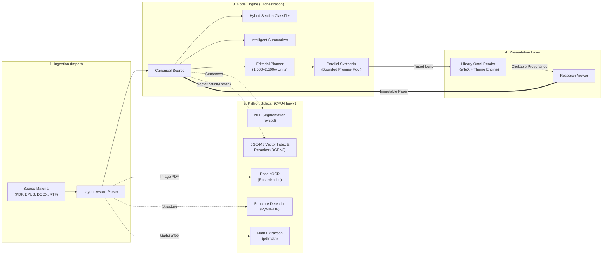

# Omnitome

> A local-first neural reading library whose differentiator is **loss-bounded, provenance-aware semantic compression**.

*Ingests PDFs, EPUBs, DOCX, RTF, web articles, and raw text. Enforces a clean architectural split: **Import** is the entry point, **Library** holds curated Omni Readings only, and **Research** holds immutable original sources where every compressed sentence traces deterministically to its source passage.*

[](https://nodejs.org/)
[](https://www.python.org/)
[](https://react.dev/)
[](https://github.com/WiseLibs/better-sqlite3)


[](https://github.com/avengersvstheflash/Smart-Reader/releases/tag/v0.6.0)
[](./LICENSE)

---

## The Two-Representation Invariant

Omnitome is a **reading and comprehension platform**, not a lossy summarization utility. It maintains two strict representations of every document:

| Representation | Behavior |
| --- | --- |
| 📄 **Original Reading** | **Immutable source.** The text exactly as uploaded. Nothing in the system modifies it. Lives in Research. |
| 🧠 **Omni Reading** | **Derived lens.** A compressed representation whose length is chosen adaptively per source unit. Distinct concepts, arguments, and claims are preserved, and every sentence is fully traceable. Lives in Library. |

**The Invariant:**

```text
ORIGINAL READING  →  immutable source, never touched
OMNI READING      →  derived lens, fully traceable back to source
```

Every feature exists to keep the relationship between source and lens visible, honest, and verifiable.

---

## 🏗️ Architecture & Data Flow

Omnitome leverages a **Hybrid Node + Python** architecture. Node.js owns orchestration, state (SQLite), and API routing. A local FastAPI Python Sidecar (`127.0.0.1:8765`) owns CPU-heavy primitives. Node is the sole SQLite writer.


```mermaid
flowchart LR
    subgraph INGESTION ["1. Ingestion (Import)"]
        RawDoc["Source Material<br/>(PDF, EPUB, DOCX, RTF)"]
        Parser["Layout-Aware Parser"]
        RawDoc --> Parser
    end

    subgraph PYTHON_SIDECAR ["2. Python Sidecar (CPU-Heavy)"]
        OCR["PaddleOCR<br/>(Rasterization)"]
        NLP["NLP Segmentation<br/>(pysbd)"]
        Structure["Structure Detection<br/>(PyMuPDF)"]
        Math["Math Extraction<br/>(pdfmath)"]
        Embedder["BGE-M3 Vector Index &<br/>Reranker (BGE v2)"]
    end

    subgraph NODE_ENGINE ["3. Node Engine (Orchestration)"]
        direction TB
        Canon["Canonical Source"]
        Classifier["Hybrid Section Classifier"]
        Synopsis["Intelligent Summarizer"]
        Planner["Editorial Planner<br/>(1,500–2,500w Units)"]
        Compressor["Parallel Synthesis<br/>(Bounded Promise Pool)"]
        
        Canon --> Classifier
        Canon --> Synopsis
        Canon --> Planner --> Compressor
    end

    Parser --> Canon
    Parser -.->|"Image PDF"| OCR
    Parser -.->|"Structure"| Structure
    Parser -.->|"Math/LaTeX"| Math
    Canon -.->|"Sentences"| NLP
    Canon -.->|"Vectorization/Rerank"| Embedder

    subgraph PRESENTATION ["4. Presentation Layer"]
        Canon ===>|"Immutable Paper"| ResearchViewer["Research Viewer"]
        Compressor ===>|"Tinted Lens"| LibraryReader["Library Omni Reader<br/>(KaTeX + Theme Engine)"]
        LibraryReader -.->|"Clickable Provenance"| ResearchViewer
    end
```

### Provider Abstraction
- **OpenRouter** (cloud fallback) or **Local** (OpenAI-compatible: Ollama at `http://localhost:11434/v1`, LM Studio, llama.cpp, vLLM).
- *Principle:* Ollama-first UX, OpenAI-compatible architecture. Trust boundaries ensure the Python sidecar NEVER calls an LLM.

---

## 🌟 Key Capabilities

### 🧠 Core Intelligence
- **Loss-Bounded Semantic Compression:** Preserves distinct concepts and causal relationships at ~7:1 density.
- **Interactive Provenance:** Paragraph-level source attribution with sentence-level segmentation.
- **Hybrid Section Classifier & Structure Detection:** Fast Python-based PyMuPDF TOC and font-size heuristics (Layer 0/1) for precise outline building.
- **Mathematical Extraction:** `pdfmath` sidecar for precise LaTeX block extraction and KaTeX rendering.

### 🎨 Theme & Visual System
- **5 Adaptive Themes:** `spring`, `sakura`, `coffee`, `cyberpunk`, `omni` — each featuring bespoke palettes, procedural cover art, and sticker architectures.
- **Animated Sigils & Decor:** Custom animations linked to themes (reduced motion supported).
- **Three Design Laws:**
  1. *Source is paper:* Original reading renders on neutral paper.
  2. *The lens is tinted:* Omni reading carries a quiet accent identity.
  3. *Derivation never masquerades as source:* Every Omni claim retains a provenance path.

---

## 🛠️ Getting Started

### Prerequisites
- **Node.js 22 LTS** (see `.nvmrc`)
- **Python 3.10+** (for the local sidecar)
- **Local LLM Engine** (Ollama recommended) or OpenRouter API key

### Installation

```bash
git clone https://github.com/avengersvstheflash/Smart-Reader.git
cd Smart-Reader

# 1. Setup Node Environment
nvm use
npm install
cp .env.example .env

# 2. Setup Python Sidecar
cd sidecars/python
python -m venv .venv
source .venv/bin/activate  # Windows: .venv\Scripts\activate
pip install -r requirements.txt
cd ../..
```

### Running the App
Requires three terminal processes:

```bash
# 1. Python Sidecar (Port 8765)
cd sidecars/python && source .venv/bin/activate && uvicorn main:app --port 8765

# 2. Node Backend (Port 3000)
node backend/server.js

# 3. React Frontend (Port 5173)
cd frontend && npm run dev
```

### Testing
```bash
node scripts/run-all-tests.js
```
*(Currently 31/31 suites passing).*

---

## 🗺️ Roadmap & Phase Status

Omnitome is developed in strict phases.

| Phase | Description | Status |
| :---: | --- | :---: |
| **5.0** | Core Capabilities | 🟢 CLOSED |
| **5.7** | Python Sidecar Foundation, OCR, Embeddings, Reranker | 🟢 CLOSED |
| **5.8a** | Omnitome Rebrand & Core Identity | 🟢 CLOSED |
| **5.8c-e** | Omni Theme Identity, Procedural Covers, Visual System | 🟢 CLOSED |
| **5.8p** | Performance & Progress (Batching, UI Progress, Limits) | 🟡 CURRENT |
| **5.8i** | Frontend Walkthrough & Verification | ⏳ QUEUED |
| **5.8j-k** | Settings, Help, Guide Pages | ⏳ QUEUED |
| **5.9** | Kokoro TTS (Python sidecar audio generation) | ⏳ QUEUED |
| **6.0** | Tauri Desktop Packaging (macOS/Windows/Linux) → v1.0 | ⏳ QUEUED |

**Current Focus (5.8p.1):** Performance optimizations including batched reranking to eliminate sequential bottlenecking and bounding `pdfmath` execution.

> For deep architectural insights, see [`docs/SESSION_HANDOFF.md`](./docs/SESSION_HANDOFF.md).

---

## 📜 Acknowledgements

Built with `pdfjs-dist`, `better-sqlite3`, `FastAPI`, `Ollama`, and `OpenRouter`. Local execution is a deliberate architecture decision, ensuring zero egress for private libraries with deterministic latency.
