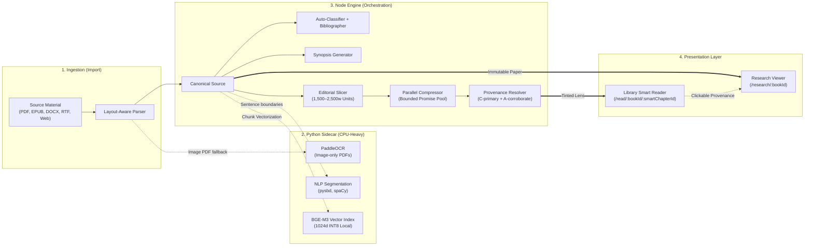

<div align="center">
  
# Smart Reader

**Local-First Neural Reading Library & Loss-Bounded Semantic Compression**

*Ingests PDFs, EPUBs, DOCX, RTF, web articles, and raw text. Enforces a clean architectural split: **Import** is the entry point, **Library** holds curated Smart Readings only, and **Research** holds immutable original sources where every compressed sentence traces deterministically to its source passage.*

[](https://nodejs.org/)
[](https://www.python.org/)
[](https://react.dev/)
[](https://github.com/WiseLibs/better-sqlite3)
<br>
[](#test)
[](#design-philosophy)
[](#roadmap)
[](./LICENSE)

</div>

---

## 📖 The Two-Representation Invariant

Smart Reader is a **reading and comprehension platform**, not a lossy summarization utility. It maintains two strict representations of every document:

| Representation | Behavior |
|---|---|
| 📄 **Original Reading** | **Immutable source.** The text exactly as uploaded. Nothing in the system modifies it. |
| 🧠 **Smart Reading** | **Derived lens.** A compressed representation whose length is chosen adaptively per source unit — every distinct concept, argument, and factual claim is preserved, with every sentence fully traceable back to its source chunks. |

**The Invariant:**
```text
ORIGINAL READING  →  immutable source, never touched
SMART READING     →  derived lens, fully traceable back to source
```

Every feature — the reader, the provenance chain, the fallback markers, the synopsis panel — exists to keep the relationship between source and lens visible, honest, and verifiable.

---

## 🗜️ Why Compression, Not Summarization?

A summarizer asks *"what is the gist?"* and produces output proportional to input. A compressor asks *"what would this say if every sentence carried several times its information?"* and preserves every distinct concept, argument, and factual claim.

Smart Reader implements **loss-bounded semantic compression**. The system assesses each source unit and chooses its target; the ratio is an observed outcome, not an input.

*   **Source processing unit:** 1,500–2,500 words
*   **Smart Chapter output:** Adaptive — compressed to the density the source requires
*   **Compression ratio:** Determined per source unit by content complexity (Observed ~4:1 to ~8:1)

> **Deep Dive:** [`docs/PRODUCT_VISION.md`](./docs/PRODUCT_VISION.md) § "Compression, not summarization".

---

## 🏗️ Architecture

Smart Reader leverages a **Hybrid Node + Python** architecture. Node.js owns orchestration, state, and API routing. A local FastAPI Python Sidecar owns CPU-heavy primitives (NLP, OCR, Embeddings).


```mermaid
flowchart LR
    subgraph INGESTION ["1. Ingestion (Import)"]
        RawDoc["Source Material
(PDF, EPUB, DOCX, RTF, Web)"]
        Parser["Layout-Aware Parser"]
        RawDoc --> Parser
    end

    subgraph PYTHON_SIDECAR ["2. Python Sidecar (CPU-Heavy)"]
        OCR["PaddleOCR
(Image-only PDFs)"]
        NLP["NLP Segmentation
(pysbd, spaCy)"]
        Embedder["BGE-M3 Vector Index
(1024d INT8 Local)"]
    end

    subgraph NODE_ENGINE ["3. Node Engine (Orchestration)"]
        direction TB
        Canon["Canonical Source"]
        Classifier["Auto-Classifier + Bibliographer"]
        Synopsis["Synopsis Generator"]
        Planner["Editorial Slicer
(1,500–2,500w Units)"]
        Compressor["Parallel Compressor
(Bounded Promise Pool)"]
        ProvResolver["Provenance Resolver
(C-primary + A-corroborate)"]
        
        Canon --> Classifier
        Canon --> Synopsis
        Canon --> Planner --> Compressor --> ProvResolver
    end

    Parser --> Canon
    Parser -.->|"Image PDF fallback"| OCR
    Canon -.->|"Sentence boundaries"| NLP
    Canon -.->|"Chunk Vectorization"| Embedder

    subgraph PRESENTATION ["4. Presentation Layer"]
        Canon ===>|"Immutable Paper"| ResearchViewer["Research Viewer
(/research/:bookId)"]
        ProvResolver ===>|"Tinted Lens"| LibraryReader["Library Smart Reader
(/read/:bookId/:smartChapterId)"]
        LibraryReader -.->|"Clickable Provenance"| ResearchViewer
    end
```

---

## ✨ Key Capabilities

### 🧠 Core Intelligence
*   **Adaptive Compression:** Grounded Smart Chapter synthesis with self-assessment. Reasoning is disabled with dynamic clamps on output length based on source complexity.
*   **Interactive Provenance:** Paragraph-level source attribution with sentence-level segmentation. Clicking any sentence chip jumps directly to the highlighted source chunk in Research mode.
*   **Auto-classification & Bibliography:** LLM-based content type, reading level, target audience, and metadata extraction with deterministic regex fallbacks.

### ⚡ Performance & Parallelism (Phase 5.7+)
*   **Python Sidecar:** FastAPI-driven local Python server handling PaddleOCR (for image-heavy PDFs), abbreviation-aware NLP sentence splitting (`pysbd`), and fast BGE-M3 embedding vectorization, and document parsing (python-docx, striprtf).
*   **Parallel Synthesis:** Node-side bounded concurrency promise pool for lightning-fast OpenRouter LLM generation, equipped with jittered exponential backoff and 429/5xx retry handling.
*   **Validation Guards:** Pre-LLM source validation and post-LLM output structure validation. Features semantic chunker hardening and automatic auto-resynthesis on persistent AI hallucinations.

### 🎨 Frontend Excellence
*   **Cinematic Import:** Pipeline stages drive page-turn, chunk-gather, and tag-fade animations dynamically.
*   **Library & Research Views:** Clean architectural split between curated Smart Readings (Library) and immutable original sources (Research).
*   **Serene UI Design:** 4 adaptive themes (default, warm, dark, glass), full Tailwind token set, and WCAG AA baseline readability.

---

## 🛠️ Tech Stack

| Layer | Technology |
|---|---|
| **Runtime** | Node.js 22 (LTS) & Python 3.10+ |
| **Backend** | Express 4.19, `better-sqlite3` (WAL mode) |
| **Frontend** | React 18.3, Vite 5.4, TypeScript 5.3, Tailwind 3.4, Zustand |
| **Embeddings** | BGE-M3 1024d, INT8 quantized, local |
| **AI (Compression)**| OpenRouter → DeepSeek V4 Flash (Ollama supported) |
| **Testing** | 26 regression suites, 100% green |

---

## 🚀 Getting Started

### Prerequisites
*   **Node.js 22 LTS** (see `.nvmrc`)
*   **Python 3.10+** (for the local sidecar)
*   **~1.2 GB free disk space** (INT8 BGE-M3 model & OCR weights download on first run)
*   *Optional:* OpenRouter API key for LLM compression

### Installation

```bash
git clone https://github.com/avengersvstheflash/Smart-Reader.git
cd Smart-Reader

# 1. Setup Node Environment
nvm use
npm install
cp .env.example .env # edit .env with your API keys

# 2. Setup Python Sidecar
cd sidecars/python
python -m venv .venv
source .venv/bin/activate  # On Windows: .venv\Scripts\activate
pip install -r requirements.txt
cd ../..
```

### Running the App

You will need three terminal windows:
```bash
# 1. Python Sidecar (Port 8765)
cd sidecars/python && source .venv/bin/activate && uvicorn main:app --port 8765

# 2. Node Backend (Port 3000)
node backend/server.js

# 3. React Frontend (Port 5173)
cd frontend && npm run dev
```
Open `http://localhost:5173/` and import a document!

### Testing
```bash
npm test # Runs all 26 regression suites
```
*(Tests execute against an isolated `storage/test-data.db` and do not touch your local library)*

---

## 🗺️ Roadmap & Progress

Smart Reader is developed in strict phases. Each phase closes cleanly (100% test pass, verified at HEAD) before the next opens.

### Phase 5 — Complete ✅

| Phase | Status | Description |
|:---:|:---:|---|
| **5.1a** | ✅ | Bibliographic metadata extraction |
| **5.1b** | ✅ | Paragraph-level provenance resolution contract |
| **5.2** | ✅ | Reader click-through UI — interactive provenance |
| **5.3** | ✅ | Research tab foundation & Library/Research architectural split |
| **5.5** | ✅ | Library polish + Smart Chapters as first-class entities |
| **5.6** | ✅ | Validation and refine loops (AI guards, Chunk hardening) |
| **5.7.1** | ✅ | Python sidecar + OCR integration (PaddleOCR) |
| **5.7.2** | ✅ | NLP migration + BGE-M3 to Python + Node parallel synthesis |
| **5.7.3** | ✅ | Capability router + DOCX/RTF ingestion |

### Later Phases
*   **Phase 6:** Tauri packaging (native desktop app installers) — *in progress*
*   **Build 5:** Audio mode (local Kokoro-82M TTS)

> Full roadmap: [`docs/ROADMAP_2026-09.md`](./docs/ROADMAP_2026-09.md).

---

## ⚖️ Design Philosophy

**Three laws. Every feature serves them:**
1. **Source is paper.** Original reading renders on calm neutral paper with zero accent chrome. It looks like a book because it *is* the book.
2. **The lens is tinted.** Smart reading carries a quiet accent identity. You know which representation you're in without reading a word.
3. **Derivation never masquerades as source.** Smart text is never rendered without a provenance affordance. Copy never calls derived text "the book."

---

## 🤝 Contributing

Solo development, active. Issues and discussion via the GitHub issue tracker.

**Commit conventions:**
`feat(scope)`, `fix(scope)`, `docs`, `chore(scope)`, `phase<N>.<M>`

*Test suite must stay green (`npm test` → 26/26 passing) through every commit.*

---

## 📜 Acknowledgements

Built with [`pdfjs-dist`](https://github.com/mozilla/pdf.js), [`better-sqlite3`](https://github.com/WiseLibs/better-sqlite3), [`FastAPI`](https://fastapi.tiangolo.com/), [`OpenRouter`](https://openrouter.ai/), and [`DeepSeek`](https://deepseek.com/). Testing was performed against purchased technical reference materials. No third-party content is redistributed.
